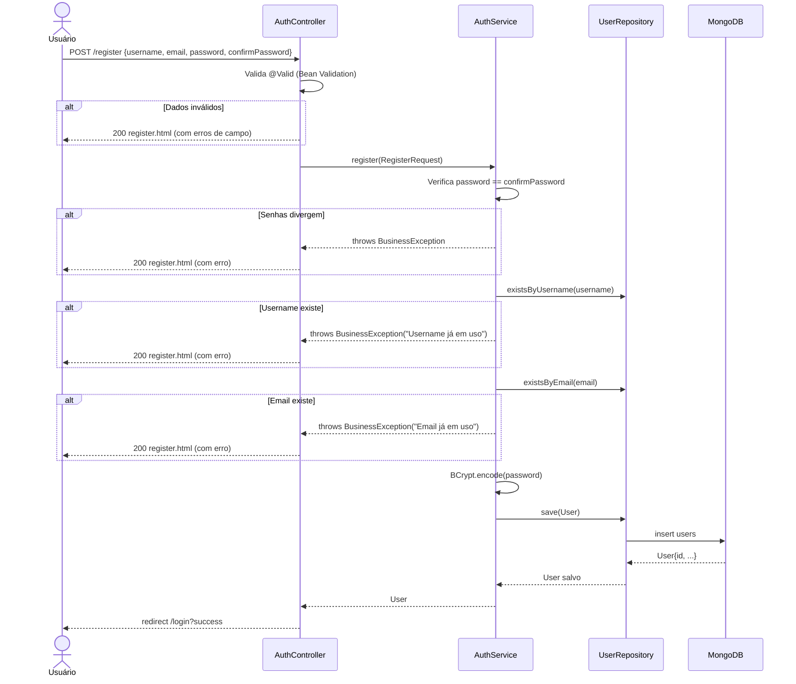
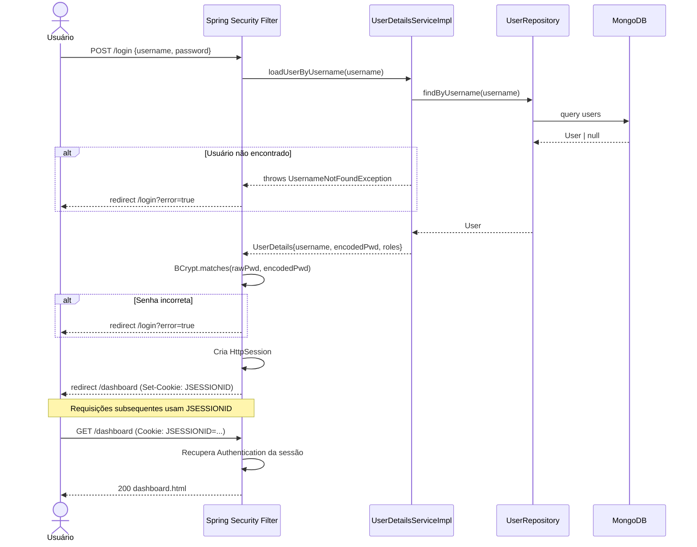
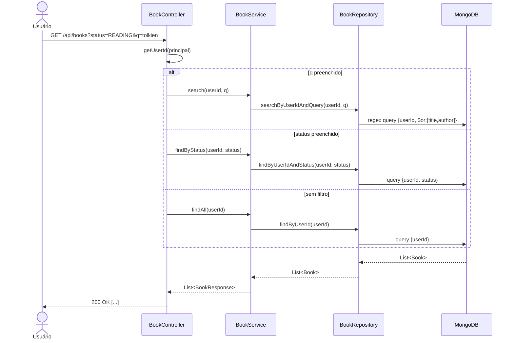
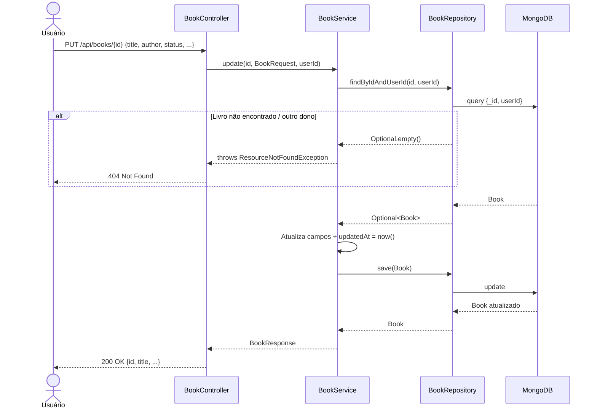
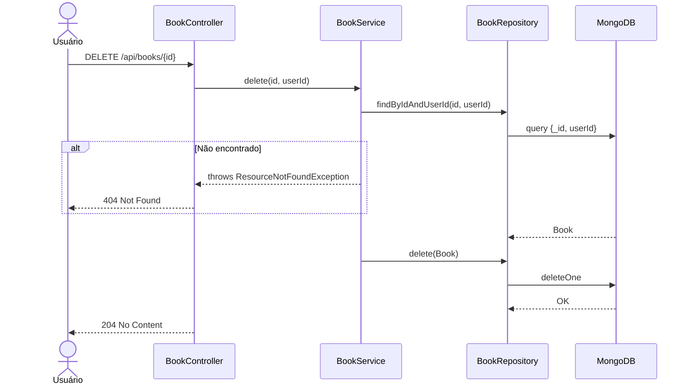
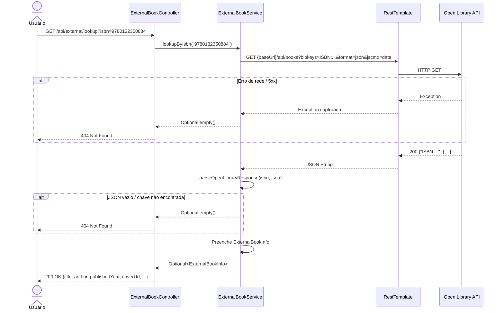

# RTM — Matriz de Rastreabilidade de Requisitos
## Gerenciador de Biblioteca Pessoal

---

## RF01 — Cadastro de Usuário

| Campo | Detalhe |
|---|---|
| Descrição | O sistema deve permitir o cadastro de novos usuários com username, email e senha |
| Implementação | `AuthService#register`, `AuthController#register`, `User` |
| Testes | `AuthServiceTest`, `AuthControllerTest`, `BookValidationTest` |
| Cobertura | Campos obrigatórios, senhas divergentes, username/email duplicado |

### Diagrama UML de Sequência — RF01

---

## RF02 — Autenticação e Gerenciamento de Sessão

| Campo | Detalhe |
|---|---|
| Descrição | O sistema deve autenticar usuários com username/senha e manter sessão HTTP |
| Implementação | `SecurityConfig`, `UserDetailsServiceImpl`, Spring Security Form Login |
| Testes | `AuthControllerTest#shouldRedirectDashboardWhenUnauthenticated` |
| Cobertura | Login válido, credenciais inválidas, acesso sem sessão, logout |

### Diagrama UML de Sequência — RF02

---

## RF03 — Cadastro de Livro (CREATE)

| Campo | Detalhe |
|---|---|
| Descrição | Usuário autenticado pode adicionar livros com título, autor, ISBN, gênero, status, avaliação |
| Implementação | `BookService#create`, `BookController#create`, `WebController#newBookPage` |
| Testes | `BookServiceTest#shouldCreateBook`, `BookControllerTest#shouldCreateBook`, `BookValidationTest` |
| Cobertura | Criação válida, campos obrigatórios, ISBN duplicado, status padrão |

### Diagrama UML de Sequência — RF03

```mermaid
sequenceDiagram
    actor U as Usuário
    participant C as BookController
    participant S as BookService
    participant R as BookRepository
    participant DB as MongoDB

    U->>C: POST /api/books {title, author, isbn, ...}
    C->>C: @Valid BookRequest
    alt Dados inválidos
        C-->>U: 400 Bad Request {errors}
    end
    C->>C: getUserId(principal) → userId
    C->>S: create(BookRequest, userId)
    alt ISBN preenchido
        S->>R: existsByIsbnAndUserId(isbn, userId)
        R->>DB: count query
        DB-->>R: count
        alt ISBN já existe
            S-->>C: throws BusinessException
            C-->>U: 400 {"message": "ISBN já existe..."}
        end
    end
    S->>S: mapToBook(request) + userId
    S->>R: save(Book)
    R->>DB: insert books
    DB-->>R: Book{id, ...}
    R-->>S: Book salvo
    S-->>C: BookResponse
    C-->>U: 201 Created {id, title, author, ...}
```

---

## RF04 — Listagem e Busca de Livros (READ)

| Campo | Detalhe |
|---|---|
| Descrição | Usuário pode listar, filtrar por status e pesquisar livros do seu acervo |
| Implementação | `BookService#findAll/findByStatus/search`, `BookController#list`, `WebController#dashboard` |
| Testes | `BookServiceTest#shouldListBooks/shouldFilterByStatus/shouldSearch`, `BookControllerTest#shouldFilterByStatusParam` |
| Cobertura | Lista vazia, filtro por status, busca por título/autor, isolamento por userId |

### Diagrama UML de Sequência — RF04

---

## RF05 — Edição de Livro (UPDATE)

| Campo | Detalhe |
|---|---|
| Descrição | Usuário pode editar todos os campos de um livro do seu acervo |
| Implementação | `BookService#update`, `BookController#update` |
| Testes | `BookServiceTest#shouldUpdateBook`, `BookControllerTest#shouldUpdateBook`, `BookServiceWhiteboxTest#shouldUpdateTimestamp` |
| Cobertura | Atualização válida, livro de outro usuário, updatedAt atualizado |

### Diagrama UML de Sequência — RF05

---

## RF06 — Remoção de Livro (DELETE)

| Campo | Detalhe |
|---|---|
| Descrição | Usuário pode remover livros do seu acervo |
| Implementação | `BookService#delete`, `BookController#delete` |
| Testes | `BookServiceTest#shouldDeleteBook`, `BookControllerTest#shouldDeleteBook`, `BookServiceWhiteboxTest#shouldThrowOnDeleteWrongOwner` |
| Cobertura | Remoção válida, livro de outro usuário |

### Diagrama UML de Sequência — RF06

---

## RF07 — Busca de Livro por ISBN (API Externa)

| Campo | Detalhe |
|---|---|
| Descrição | O sistema consulta a API Open Library para obter metadados de um livro pelo ISBN |
| Implementação | `ExternalBookService#lookupByIsbn`, `ExternalBookController#lookup` |
| Testes | `ExternalBookVcrTest` (WireMock/VCR) |
| Cobertura | ISBN encontrado, não encontrado, erro 500, JSON malformado, 1 chamada por requisição |

### Diagrama UML de Sequência — RF07

---

## RF08 — Estatísticas do Acervo

| Campo | Detalhe |
|---|---|
| Descrição | O sistema exibe contadores por status (total, lendo, lido, quero ler) |
| Implementação | `BookService#getStats`, `BookController#stats` |
| Testes | `BookServiceTest#shouldReturnStats`, `BookControllerTest#shouldReturnStats`, `BookServiceWhiteboxTest#shouldReturnZeroStatsWhenEmpty` |
| Cobertura | Acervo com livros mistos, acervo vazio |

---

## Cobertura por Tipo de Teste

| Tipo | Classe(s) | RFs cobertos |
|---|---|---|
| Unitário / Integração (Testcontainers) | `AuthServiceTest`, `BookServiceTest` | RF01, RF03–RF08 |
| Caixa Preta / E2E Controller | `AuthControllerTest`, `BookControllerTest` | RF01–RF06, RF08 |
| Parametrizado | `BookValidationTest` | RF01, RF03 |
| Caixa Branca | `BookServiceWhiteboxTest` | RF03–RF08 |
| VCR (WireMock) | `ExternalBookVcrTest` | RF07 |
| Integração completa | `BookIntegrationTest` | RF01, RF03–RF08 |

> **Meta:** ≥ 80% de cobertura de instruções, validada pelo `jacoco-maven-plugin:check` em `mvn verify`.
